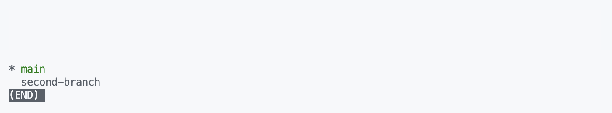

# Git Branch 관리

- [Git Branch 관리](#git-branch-관리)
- [git branch (switch)](#git-branch-switch)
- [git checkout](#git-checkout)

깃의 꽃이다

1) 혼자 작업할 때: 현재 웹 앱을 만들다가 실시간 알림 기능을 추가하고 싶어졌다. 하지만 한 번에 만들 수 있을 거란 확신이 없어서 무수히 많은 커밋을 해야 완성할 수 있을 것 같다. 그리고 실패 시에는 커밋을 이전으로 되돌리고 싶은데, 현재 메인 브랜치의 로그가 지저분해지는 것은 원치 않는다.

2) 협업할 때: A와 B 두 명이서 협업을 하는 상황이다 깃허브에 코드를 올려놓고 각자 다운로드 받아 코딩을 하고 있는데, 둘이 각자 다른 팡리으 작업하면 별 걱정이 없겠지만, 하나의 파일을 둘이 동시에 작업하고 있다. 문제는 이렇게 여러 명이 같은 파일을 작업해서 커밋한 후, 동시에 푸시를 하면 충돌이 생긴다는 것이다. A가 한 커밋은 B에겐 없고, B가 한 커밋은 A에게 없기 떄문

이런 상황에서 **branch**를 따서 사용한다.

# git branch (switch)

`git branch [브랜치명]`을 입력해 새로운 브랜치를 생성한다.

잘 생성되었나 보려면 `git branch`를 쳐보면 앞에 `*` 표시가 있는 것이 현재 HEAD가 있는 branch이다.



# git checkout

새로 만든 *second-branch* 브랜치에서 작업하려면 *HEAD*를 옮겨야 한다, 이 때 사용하는 명령어가 `git checkout [브랜치명]`이다.

`git checkout`은 파일에 사용할 경우 *Modified* ➡️ *Unmodified*, 브랜치에 사용할 경우엔 브랜치 간 전환을 한다.

`git branch second-branch`로 브랜치를 이동한 뒤에 **git.html**을 다음과 같이 수정한다.

```html
<!DOCTYPE html>
<html>
<head>
  <title>깃 연습</title>
  <link rel="stylesheet" href="./git.css" />
</head>
<body>
  <h1>깃 브랜치</h1>
  <p><b>깃 브랜치</b>의 사용 방법에 대해 알아봅시다</p>
</body>
</html>
```

그리고나서 커밋을 할 경우에 새로운 브랜치 *second-branch*가 *main*보다 한 단계 더 앞서있다. 브랜치 별로는 커밋이 따로 적용된다.

즉 *main*과 *second-branch*는 *Second Commit* 까지는 공유하지만 그 다음부터는 별개의 프로젝트라고 봐도 된다.

각자 작업을 마치면 최종적으로 합쳐야 하는데, 우선 다시 `git checkout main` 명령어를 사용하여 *main* 브랜치로 돌아간 다음 *merge*, *rebase*를 사용하여 합칠 수 있다.