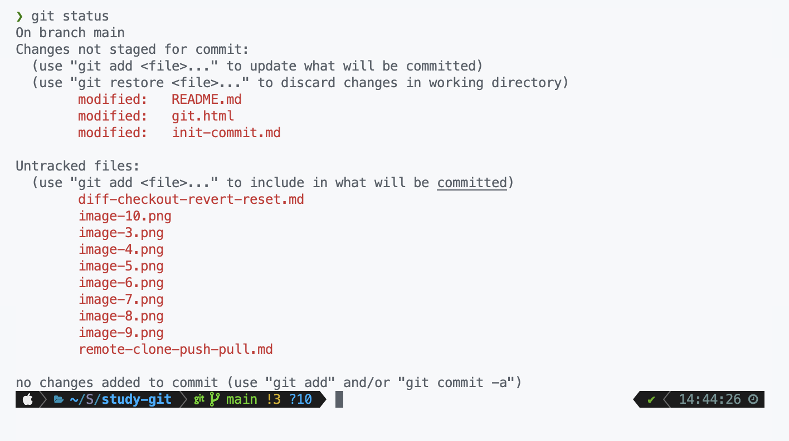

> 알아볼 명령어

[diff](#git-diff)
[checkout](#git-checkout)
[reset](#git-reset)
[revert](#git-revert)

<hr />

실수로 잘못 커밋했다고 가정하고 진행해보자

Git에는 크게 *Untracked*, *Tracked* 두 가지 상태가 있다고 했다.

여기서 다시 *Tracked*는 세 가지 상태로 나뉜다.

****git.html****을 다음과 같이 수정한다.

```html
<!DOCTYPE html>
<html>
	<head>
		<title>깃 연습</title>
		<link rel="stylesheet" href="./git.css" />
	</head>
	<body>
		<h1>깃 수정</h1>
		<p><b>깃</b> 파일을 수정했습니다.</p>
	</body>
</html>
```

`git status`로 상태를 확인해보자.



*Changes not staged for commit:&nbsp;* 이라면서 *modeifed: git.html*이 있다. 수정된 파일도 직접 **add**를 해줘야 다음 커밋에 반영된다.

커밋은 Git에서 하나의 **단위**로 취급된다.

➡️ 최대한 잘게 커밋을 해주어야 나중에 자유자재로 원하는 부분만 변경을 할 수 있게 된다.

# git diff

수정된 파일에서 어떤 부분이 달라졌는지 확인할 수 있다.


설정에서 `git difftool`을 vscode로 설정하면 좀 더 편하게 볼 수 있다.


위의 그림은 *Untracked*와 *Tracked*의 3단계를 보여준다.

- *Unmodified*: 커밋을 한 후 변경점이 없음
- *Modified*: *Tracked*인 파일의 변경점이 있음
- *Staged*: 변경한 파일을 **add** 했을 때의 상태. 커밋할 준비가 되었음을 뜻한다. 커밋할 경우 다시 *Unmodified* 상태가 된다.

# git checkout (restore)

➡️ 현재 **switch**와 **restore**로 분리되었다.

*Modified* ➡️ *Unmodified*

*Modified* 상태의 파일을 **add** 하지 않고 다시 *Unmodified* 상태로 되돌린다.

# git reset

1. *Staged* ➡️ *Modified*

만약 **add** 까지 해서 *Modified*가 아니라 *Staged* 상태인 파일을 *Modified*로 되돌린다. 그 후 **checkout**을 이용해 *Unmodified* 상태로 되돌릴 수 있다.

2. 커밋한 후에 되돌릴 때 사용

- **--soft**: 커밋한 후의 상태에서 커밋 전의 *Staged* 상태로 만든다.
- **--mixed**: 커밋한 후의 상태에서 커밋 전의 *Modified* 상태로 만든다. 기본 값
- **--hard**: 커밋한 후의 상태에서 커밋 전의 *Unmodified*로 만든다.

# git revert

**reset**과 비슷하지만 이전 커밋 내용을 새 커밋으로 만들어서 저장한다.

무슨 말인지 모르겠으니까 직접 해보자

우선 커밋을 한 후에 `git revert HEAD`를 한다. 현재 HEAD를 취소하고 이전 HEAD로 돌아간다는 뜻이다.


**reset** 이전 커밋으로 직접 되돌아갔다면 **revert**는 현재 커밋 위에 이전 커밋을 덮어씌우는 개념이기 때문에 새로운 커밋이 하나 추가되었다.

> 그래서 언제 쓰는데

커밋을 이미 **push**해서 서버에 저장해버린 경우에 주로 사용한다.

서버에는 이미 잘못된 커밋이 저장되었기 때문에 클라이언트에서 **reset**을 해봤자 서버에서는 되돌릴 수 없다. 그래서 커밋을 덮어쓰는 **revert**를 사용한다.