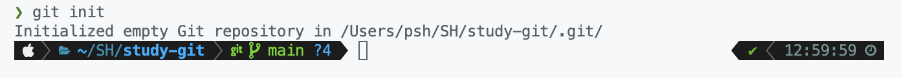

# git init

터미널에서 내 프로젝트 폴더 위치로 이동한다. `cd [경로]` 명령어를 사용하면 된다.

그 뒤 `git init`을 쳐보면 `**Initialize empty Git repository in [경로]**` 라고 한 줄이 나오고, 폴더 안에 .git이라는 숨겨진 폴더가 생성된다.

이제부터 프로젝트에 `Git`을 사용할 수 있다.

# git status

현재 파일들의 상태를 볼 수 있다.

