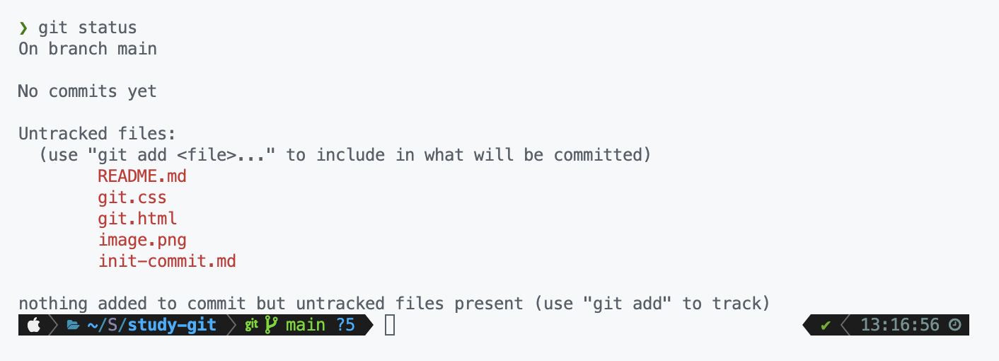
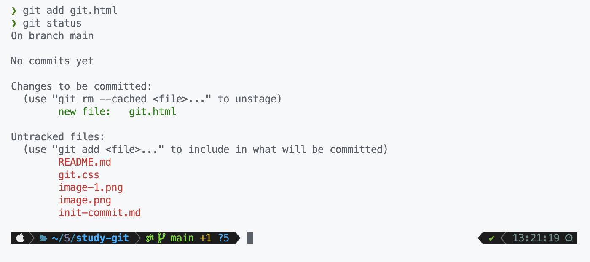
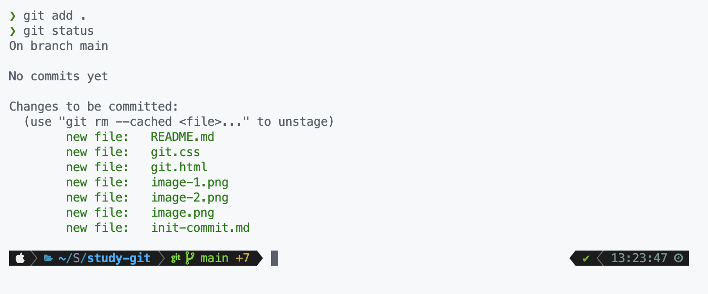
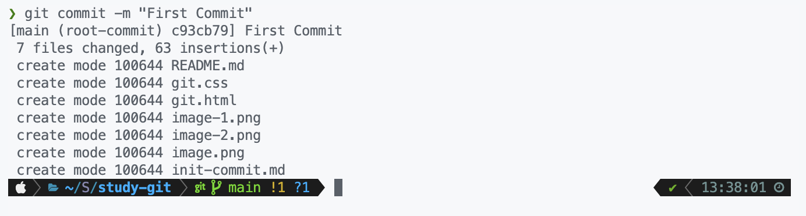
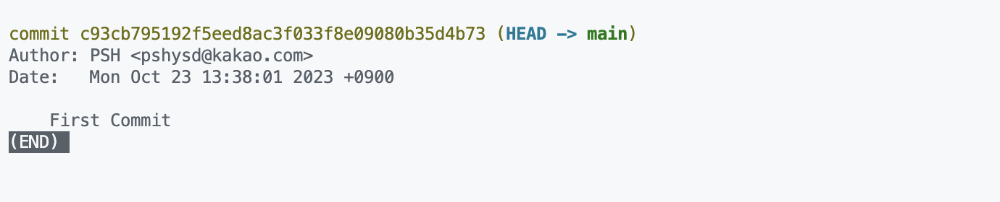

> 알아볼 명령어

- [git init](#git-init)
- [git status](#git-status)
- [git add](#git-add)
- [git commit](#git-commit)
- [git log](#git-log)

# git init

터미널에서 내 프로젝트 폴더 위치로 이동한다. `cd [경로]` 명령어를 사용하면 된다.

그 뒤 `git init`을 쳐보면 `**Initialize empty Git repository in [경로]**` 라고 한 줄이 나오고, 폴더 안에 .git이라는 숨겨진 폴더가 생성된다.

이제부터 프로젝트에 `Git`을 사용할 수 있다.

# git status

현재 파일들의 상태를 볼 수 있다.

한 줄씩 알아보자

- On branch `main`: 현재 `branch`가 `main`이다.
- No commits yet: 아직 아무것도 커밋하지 않았다는 뜻
- Untracked files ~ ...: 아직 git이 관리하고 있지 않은 파일들이다. 이들을 commit 대상에 포함시키려면 `git add [파일 이름]`을 하라고 친절하게 안내해준다.

# git add

`git add git.html`를 하고 다시 `git status`를 해보자.

이번엔 초록색으로 git.html이 올라가있다. `new file: git.html`이라고 commit할 대기열에 올라가있다는 것을 알려준다. 이 상태로 commit을 하면 아직 `git.css`는 저장되지 않는다. `git add`를 하지 않았기 때문.

이제 `git.css`도 `git add git.css`로 저장해주자.

그런데 만약 파일이 아주 많다면 하나하나 파일명을 입력해주긴 힘들테니 `git add .` 명령어를 이용해 Untracked 파일들을 모두다 스테이징 시켜주자.

모든 파일이 `Tracked` 상태이다.

> add된 파일을 다시 `Untracked`로 되돌리려면 `git rm [파일명]`을 입력하자!

# git commit

이제 모든 파일이 `commit` 대기 중이니까 commit을 해봐야한다. `git commit -m [설명]`이라고 입력해보자. `-m` 옵션이 다음에 설명이 온다는 것을 표시한다.

`First Commit`이라는 메시지를 넣어 commit을 했다.

> `git commit -am [설명]`을 입력하면 add와 commit을 동시에 해준다!

# git log

commit된 내역을 볼 수 있다.

