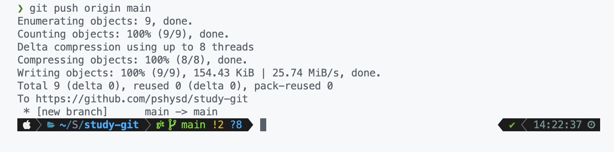

# 깃허브 원격 저장소 생성

뭐 별거 없다

처음 생성하면 요로코롬 생겼음

우리는 현재 로컬 저장소(git init)를 생성해뒀기 때문에 깃허브 원격 저장소와 연동하는 작업을 해주면 되기 때문에

요 명령어를 순서대로 쳐주면 되시겠다

# git remote

터미널에 원격 저장소를 `remote` 명령어로 등록해주자

> 원격 저장소를 지우고 싶다면 `git remote remove origin`

# git push

git init으로 깃 로컬 저장소 생성, add로 스테이징, commit으로 로컬 저장소에 저장을 했다면, push로는 깃허브 원격 저장소에 저장을 할 수 있다.

`git push origin main`이라고 입력해준다.

# git pull

다른 사람이 PR을 통해서 코드를 업데이트 했거나, 아니면 Github을 통해서 commit 했을 때 그 내용을 클라이언트로 내려받는 명령어이다. `git pull origin main` 하면 origin의 내용이 main으로 복사된다.

git pull을 할 때 깃허브의 유저 이름과 비밀번호를 쳐야하는 경우가 많다. 매번 비밀번호를 치기 귀찮다면

`git config --global credential.helper 'store --file 경로`하면 된다. 해당 경로에 비밀번호가 저장된 파일이 생성된다. 단, 파일로 저장되는 만큼 보안에 취약하기 때문에 주의해야 한다.

# git clone

`git pull`과 비슷하지만 `git init`이 되지 않았을 때, (로컬 저장소가 없을 때 === .git 폴더가 없을 때) 서버의 프로젝트를 내려받는 명령어이다. `git clone [저장소 주소]`를 하면 된다.